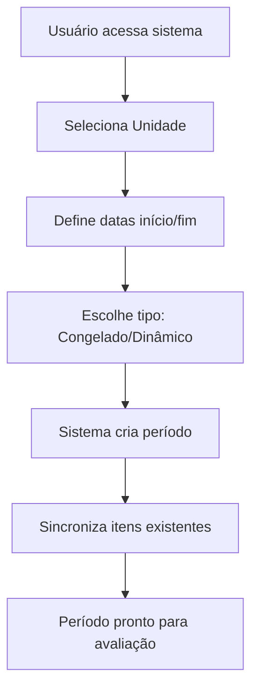
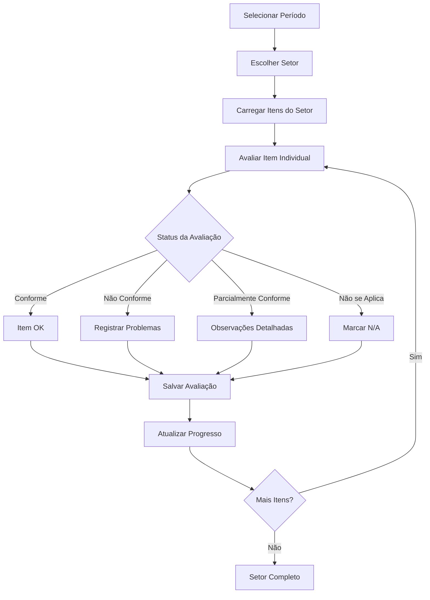
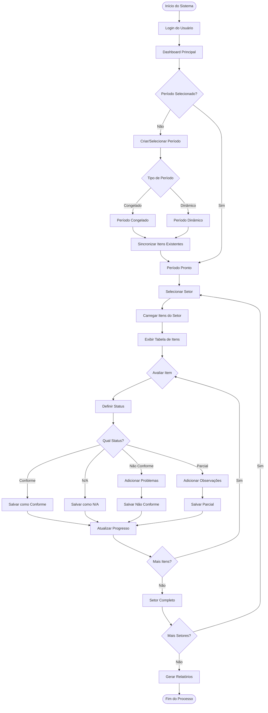

# Sistema de Diagnóstico de Qualidade Hospitalar

## 📋 Visão Geral

O Sistema de Diagnóstico de Qualidade Hospitalar é uma aplicação web completa desenvolvida para facilitar a avaliação e o monitoramento da qualidade em instituições de saúde. O sistema permite que hospitais realizem diagnósticos sistemáticos de conformidade com padrões de qualidade estabelecidos, organizados por períodos, setores e critérios específicos.

## 🎯 Objetivo Principal

Facilitar o processo de **acreditação hospitalar** e **gestão da qualidade** através de:
- Avaliação sistemática de critérios de qualidade
- Monitoramento de progresso em tempo real
- Controle de períodos de avaliação
- Geração de relatórios de conformidade
- Rastreabilidade completa das avaliações

### Unidades Hospitalares Atendidas (Exemplos do Sistema Real)

O sistema atualmente gerencia a qualidade de **96 unidades de saúde**, incluindo:

**Hospitais Principais:**
- Hospital Aquiles Lisboa
- Hospital Genesio Rego  
- Hospital Regional Alarico Nunes
- MARI Imperatriz

**UPAs (Unidades de Pronto Atendimento):**
- UPA Bacanga
- UPA Parque Vitória
- UPA Cidade Operária

**Policlínicas:**
- Policlínica Coroadinho
- Policlínica Cohatrac

**Outros Serviços:**
- Agência Transfusional de Bacabal
- FEME (Fundação Estadual do Menor)
- SVO São Luís
- Solar do Outono

## 🏗️ Arquitetura do Sistema

### Estrutura Hierárquica Real do Sistema

**Dados atuais do banco (sistema em produção):**
- **96 Unidades hospitalares** cadastradas
- **11 Setores** principais definidos
- **59 Subsetores** distribuídos entre os setores
- **1.219 Itens de diagnóstico** padronizados
- **6 Períodos** de avaliação ativos
- **3.429 Avaliações** realizadas
- **217 Problemas** identificados e documentados

```
Hospital/Unidade (96 unidades)
 ├── Exemplos: UPA Bacanga, Hospital Aquiles Lisboa, FEME
 │
 └── Setores (11 setores principais)
     ├── GESTÃO (38 itens) → 1 subsetor
     ├── URGÊNCIA/EMERGÊNCIA (100 itens) → 8 subsetores
     ├── INTERNAÇÃO (216 itens) → 21 subsetores
     ├── CENTRO CIRÚRGICO (0 itens) → 4 subsetores
     ├── OBSTETRÍCIA (261 itens) → 9 subsetores
     ├── AMBULATÓRIO (92 itens) → 2 subsetores
     ├── NUTRIÇÃO (314 itens) → 4 subsetores
     ├── FARMÁCIA (52 itens) → 1 subsetor
     ├── NÚCLEOS (82 itens) → 3 subsetores
     ├── CME (32 itens) → 3 subsetores
     └── EXAMES (32 itens) → 3 subsetores
         │
         └── Subsetores (59 subsetores)
             ├── Ex: FARMÁCIA ALMOXARIFADO
             ├── Ex: AMBULATÓRIO
             ├── Ex: SALA DE EXAMES IMAGEM
             └── Ex: ÁREA LIMPA (CME)
                 │
                 └── Itens de Diagnóstico (1.219 critérios)
                     ├── Ex: "ESCALA DISPONÍVEL NO SETOR"
                     ├── Ex: "PROTOCOLOS, POPS E NRS FARMÁCIA"
                     ├── Ex: "DIMENSIONAMENTO DE ACORDO COM O CONSELHO"
                     └── Ex: "TREINAMENTOS REALIZADOS – EVIDÊNCIAS"
                         │
                         └── Avaliações (3.429 avaliações)
                             ├── CONFORME: 942 (42.0%)
                             ├── NÃO CONFORME: 705 (31.4%)
                             ├── PARCIALMENTE CONFORME: 486 (21.7%)
                             └── SEM STATUS: 110 (4.9%)
```

### Componentes Principais

#### 1. **Controller Principal** (`implantacao.php`)
- **Função**: Ponto de entrada central do sistema
- **Responsabilidades**:
  - Roteamento de requisições HTTP e AJAX
  - Gerenciamento de sessões e autenticação
  - Interface entre frontend e backend
  - Renderização da interface do usuário

#### 2. **Camada de Negócio** (`implantacao_helpers.php`)
- **Função**: Lógica de negócio e operações de dados
- **Responsabilidades**:
  - Operações CRUD (Create, Read, Update, Delete)
  - Cálculos de progresso e estatísticas
  - Sincronização de dados entre períodos
  - Gerenciamento de transações

#### 3. **Interface Frontend** (Módulos JavaScript)
- **`implantacao-core.js`**: Inicialização e configuração geral
- **`implantacao-ui.js`**: Gerenciamento da interface do usuário
- **`implantacao-crud.js`**: Operações de dados via AJAX
- **`implantacao-tabulator.js`**: Funcionalidades de tabelas avançadas
- **`implantacao-data.js`**: Transformação e validação de dados

### Períodos de Diagnóstico Ativos (Dados Reais)

| ID | Unidade | Início | Fim | Congelado | Total Avaliações |
|----|---------|--------|-----|-----------|------------------|
| 23 | Agência Transfusional de Bacabal | 07/05/2025 | 28/05/2025 | ✅ Sim | 767 |
| 22 | UPA Parque Vitória | 14/04/2025 | 28/04/2025 | ✅ Sim | 700 |
| 17 | MARI Imperatriz | 07/04/2025 | 28/04/2025 | ❌ Não | 1.215 |
| 14 | Hospital Regional Alarico Nunes | 19/03/2025 | 28/04/2025 | ❌ Não | 715 |
| 9 | Hospital Regional Alarico Nunes | 17/03/2025 | 28/04/2025 | ❌ Não | 32 |

**Estatísticas de Conformidade (Sistema Real):**
- **Conformes**: 942 avaliações (42.0%) - ✅ Atende completamente
- **Não Conformes**: 705 avaliações (31.4%) - ❌ Não atende aos critérios
- **Parcialmente Conformes**: 486 avaliações (21.7%) - ⚠️ Atende parcialmente
- **Sem Status**: 110 avaliações (4.9%) - ⏳ Aguardando avaliação

### Exemplos Detalhados de Critérios por Setor

#### **GESTÃO** (38 critérios)
- Alvará de funcionamento
- Alvará de vigilância sanitária
- Documentação de RT (Responsável Técnico)
- Planejamento estratégico
- Organograma institucional
- Política "adorno zero"
- Protocolo de profilaxia após exposição

#### **URGÊNCIA/EMERGÊNCIA** (100 critérios)
**Classificação de Risco (19 itens):**
- Protocolo de classificação
- Classificação realizada por enfermeiro
- Sistema de software para classificação
- Sinalização de riscos
- Conhecimento das metas de segurança

**Sala de Medicação (30 itens):**
- Prescrição médica legível com identificação completa
- Medicações de alta vigilância sinalizadas
- Medicações organizadas em local identificado
- Aprazamento de medicações assinado
- Identificação de alergias na prescrição

#### **NUTRIÇÃO** (314 critérios - maior setor)
**Nutrição Clínica (27 itens):**
- Nutricionista RT com registro no conselho
- Triagem de risco nutricional
- Critérios para diagnóstico da desnutrição (GLIM 2019)
- Prescrição dietoterápica no prontuário
- Mapa diário de visita nutricional

**Lactário (100 itens):**
- Temperatura 65°C por 15 minutos (conforme ILSI 2017)
- Higienização das mãos em posição adequada
- Controle de temperatura entre 20 e 24°C
- Identificação do paciente e correspondência
- Uso de insumos alimentícios registrados

### Problemas Mais Identificados (Sistema Real)

1. **"AUSÊNCIA DE PIA PARA LAVAGEM DOS UTENSÍLIOS ÁREA SUJA POSICIONADOS EM AMBIENTE ISOLADO"**
2. **"AUSÊNCIA DO NUTRICIONISTA COM REGISTRO CONFORME CFN Nº378/2005"**
3. **"NÚMERO DE PROFISSIONAIS EM DESACORDO COM AS RDCs Nº600/2018 E 663/2020"**
4. **"AUSÊNCIA DE ESCALA DE PROFISSIONAIS EM LOCAL VISÍVEL"**
5. **"AUSÊNCIA DE ADMISSÃO NUTRICIONAL EM 24H"**

## 📊 Estrutura do Banco de Dados

### Tabelas Principais

#### `unidade` - Unidades Hospitalares
| Campo | Tipo | Descrição |
|-------|------|-----------|
| id | INT | Identificador único |
| unidade | VARCHAR | Nome da unidade hospitalar |

#### `setores` - Setores do Hospital
| Campo | Tipo | Descrição |
|-------|------|-----------|
| id | INT | Identificador único |
| nome | VARCHAR | Nome do setor (UTI, Emergência, etc.) |
| deletado | TINYINT | Flag de exclusão lógica |

#### `subsetores` - Subdivisões dos Setores
| Campo | Tipo | Descrição |
|-------|------|-----------|
| id | INT | Identificador único |
| setor_id | INT | Referência ao setor |
| nome | VARCHAR | Nome do subsetor |
| deletado | TINYINT | Flag de exclusão lógica |

#### `periodo_diagnostico` - Períodos de Avaliação
| Campo | Tipo | Descrição |
|-------|------|-----------|
| id | INT | Identificador único |
| id_unidade | INT | Referência à unidade |
| data_inicio | DATE | Data de início do período |
| data_fim | DATE | Data de fim do período |
| is_frozen | TINYINT | Indica se o período está "congelado" |
| deletado | TINYINT | Flag de exclusão lógica |

#### `items_diagnostico` - Critérios de Avaliação
| Campo | Tipo | Descrição |
|-------|------|-----------|
| id | INT | Identificador único |
| nome_item | TEXT | Descrição do critério |
| subsetor_id | INT | Referência ao subsetor |
| setor_id | INT | Referência ao setor |
| unidade_id | INT | Referência à unidade |
| deletado | TINYINT | Flag de exclusão lógica |

#### `diagnostico` - Avaliações Realizadas
| Campo | Tipo | Descrição |
|-------|------|-----------|
| id | INT | Identificador único |
| unidade_id | INT | Referência à unidade |
| setor_id | INT | Referência ao setor |
| id_periodo_diagnostico | INT | Referência ao período |
| item | TEXT | Descrição do item avaliado |
| item_hash | VARCHAR(32) | Hash para identificação única |
| avaliacao_resultado | VARCHAR | Status da avaliação |
| observacoes | VARCHAR | Observações do avaliador |
| nao_se_aplica | INT | Flag "não se aplica" |
| estado_avaliacao | ENUM | Estado da avaliação |

#### `problemas_diagnostico` - Problemas Identificados
| Campo | Tipo | Descrição |
|-------|------|-----------|
| id | INT | Identificador único |
| id_items_diagnostico | INT | Referência ao item |
| nome | VARCHAR | Descrição do problema |
| deletado | TINYINT | Flag de exclusão lógica |

### Relacionamentos Principais

```sql
-- Unidade → Setores (via unidade_setores)
unidade.id ← unidade_setores.unidade_id
setores.id ← unidade_setores.setor_id

-- Setores → Subsetores
setores.id ← subsetores.setor_id

-- Subsetores → Itens
subsetores.id ← items_diagnostico.subsetor_id

-- Período → Avaliações
periodo_diagnostico.id ← diagnostico.id_periodo_diagnostico

-- Itens → Problemas
items_diagnostico.id ← problemas_diagnostico.id_items_diagnostico
```

## 🔄 Fluxo de Funcionamento

### 1. **Criação de Período de Diagnóstico**



**Tipos de Período:**
- **Congelado (is_frozen = 1)**: Itens fixos, novos itens precisam ser sincronizados manualmente
- **Dinâmico (is_frozen = 0)**: Novos itens são automaticamente incluídos

### 2. **Processo de Avaliação**



### 3. **Estados de Avaliação**

| Estado | Descrição | Ação Requerida |
|--------|-----------|----------------|
| **Conforme** | Atende totalmente aos critérios | Apenas observações opcionais |
| **Não Conforme** | Não atende aos critérios | Obrigatório registrar problemas |
| **Parcialmente Conforme** | Atende parcialmente | Observações detalhadas |
| **Não se Aplica** | Critério não aplicável | Justificativa opcional |
| **Pendente** | Ainda não avaliado | Avaliação necessária |

### 4. **Cálculo de Progresso**

```javascript
// Fórmula de Cálculo do Progresso
const progresso = {
    total: totalItens,
    avaliados: conformes + naoConformes + parcialmentConformes + naoSeAplica,
    pendentes: total - avaliados,
    percentual: (avaliados / total) * 100,
    conformidade: ((conformes + (parcialmentConformes * 0.5)) / (total - naoSeAplica)) * 100
};
```

## 🛠️ Regras de Negócio

### 1. **Gestão de Períodos**

#### Criação de Período
- **Validação de Datas**: Data fim deve ser posterior à data início
- **Unidade Obrigatória**: Todo período deve estar vinculado a uma unidade
- **Sincronização Inicial**: Ao criar período, todos os itens ativos são copiados
- **Status de Congelamento**: Definido na criação e pode ser alterado posteriormente

#### Período Congelado vs. Dinâmico
- **Congelado**: Garante estabilidade do escopo durante avaliação
- **Dinâmico**: Permite inclusão automática de novos critérios
- **Sincronização Forçada**: Administradores podem forçar sync em períodos congelados

### 2. **Avaliação de Itens**

#### Obrigatoriedades
- **Status Obrigatório**: Todo item deve ter um status definido (exceto "Não se Aplica")
- **Problemas para Não Conformes**: Itens não conformes devem ter problemas registrados
- **Observações Recomendadas**: Especialmente para casos parcialmente conformes

#### Validações
```php
// Validação de Avaliação
if (!$naoSeAplica && empty($status)) {
    throw new Exception('Status é obrigatório quando item se aplica');
}

if ($status === 'nao_conforme' && empty($problemas)) {
    throw new Exception('Problemas são obrigatórios para itens não conformes');
}
```

### 3. **Controle de Acesso**

#### Níveis de Acesso
- **Avaliador**: Pode avaliar itens dentro de períodos ativos
- **Coordenador**: Pode gerenciar períodos e exportar relatórios
- **Administrador**: Acesso total, incluindo sincronização forçada

#### Restrições por Status
- **Período Expirado**: Apenas visualização, sem edição
- **Período Congelado**: Apenas itens sincronizados podem ser avaliados
- **Item Já Avaliado**: Pode ser re-avaliado com log de auditoria

### 4. **Integridade de Dados**

#### Transações
```php
// Exemplo de Transação para Salvar Avaliação
$conn->beginTransaction();
try {
    // 1. Atualizar avaliação
    updateAvaliacao($itemId, $status, $observacoes);
    
    // 2. Salvar problemas relacionados
    salvarProblemas($itemId, $problemas);
    
    // 3. Atualizar cache de progresso
    atualizarCacheProgresso($periodoId, $setorId);
    
    $conn->commit();
} catch (Exception $e) {
    $conn->rollback();
    throw $e;
}
```

#### Auditoria
- **Log de Alterações**: Todas as modificações são registradas
- **Usuário Responsável**: ID do usuário é salvo em cada operação
- **Timestamp**: Data/hora de criação e modificação
- **Soft Delete**: Exclusões lógicas mantêm histórico

## 📈 Relatórios e Indicadores

### 1. **Indicadores de Progresso**

#### Por Setor
```sql
SELECT 
    s.nome as setor,
    COUNT(*) as total_itens,
    SUM(CASE WHEN d.avaliacao_resultado IS NOT NULL THEN 1 ELSE 0 END) as avaliados,
    SUM(CASE WHEN d.avaliacao_resultado = 'conforme' THEN 1 ELSE 0 END) as conformes,
    SUM(CASE WHEN d.nao_se_aplica = 1 THEN 1 ELSE 0 END) as nao_aplica
FROM setores s
LEFT JOIN diagnostico d ON d.setor_id = s.id 
WHERE d.id_periodo_diagnostico = ?
GROUP BY s.id, s.nome
```

#### Geral do Período
- **Percentual de Conclusão**: (Itens Avaliados / Total Itens) × 100
- **Taxa de Conformidade**: (Conformes / (Total - Não se Aplica)) × 100
- **Índice de Qualidade**: Média ponderada considerando conformidade parcial

### 2. **Relatórios Disponíveis**

#### Relatório de Conformidade
- Lista todos os itens por setor
- Status de cada avaliação
- Problemas identificados
- Observações dos avaliadores

#### Relatório de Progresso
- Percentual de conclusão por setor
- Comparativo entre períodos
- Tendências de melhoria

#### Relatório de Não Conformidades
- Listagem de todos os problemas identificados
- Agrupamento por tipo/categoria
- Planos de ação recomendados

## 🔧 Configuração e Instalação

### Pré-requisitos
- **PHP 7.4+** com extensões PDO/MySQL
- **MySQL 5.7+** ou **MariaDB 10.3+**
- **Servidor Web** (Apache/Nginx)
- **JavaScript ES6+** compatível

### Estrutura de Arquivos
```
sistema_antigo/
├── implantacao.php              # Controller principal
├── implantacao_helpers.php      # Funções de negócio
└── implantacao/                 # Módulos JavaScript
    ├── implantacao-core.js      # Inicialização
    ├── implantacao-ui.js        # Interface
    ├── implantacao-crud.js      # Operações de dados
    ├── implantacao-data.js      # Manipulação de dados
    └── implantacao-tabulator.js # Funcionalidades de tabela
```

### Dependências Frontend
- **Tabulator 5.4+**: Tabelas interativas
- **Bootstrap 5**: Interface responsiva
- **Toastr**: Notificações
- **LoadingBar.js**: Indicadores de progresso

## 🚀 Funcionalidades Avançadas

### 1. **Sincronização Inteligente**
- Detecção automática de novos itens
- Sincronização seletiva para períodos congelados
- Prevenção de duplicatas via hash

### 2. **Interface Responsiva**
- Adaptação automática para dispositivos móveis
- Navegação por toque otimizada
- Tabelas com scroll horizontal

### 3. **Performance Otimizada**
- Carregamento lazy de dados por setor
- Cache de progresso para reduzir consultas
- Paginação automática em tabelas grandes

### 4. **Experiência do Usuário**
- Salvamento automático de rascunhos
- Indicadores visuais de progresso
- Validação em tempo real
- Atalhos de teclado

## 📊 Diagrama de Fluxo Completo



## 📝 Considerações Finais

Este sistema representa uma solução completa para gestão da qualidade hospitalar, oferecendo:

- **Flexibilidade**: Adaptável a diferentes estruturas organizacionais
- **Controle**: Períodos congelados garantem integridade das avaliações
- **Rastreabilidade**: Histórico completo de todas as operações
- **Usabilidade**: Interface intuitiva para usuários não técnicos
- **Escalabilidade**: Arquitetura preparada para grandes volumes de dados

O sistema é especialmente adequado para processos de **acreditação hospitalar**, **auditorias de qualidade** e **melhoramento contínuo** em instituições de saúde.